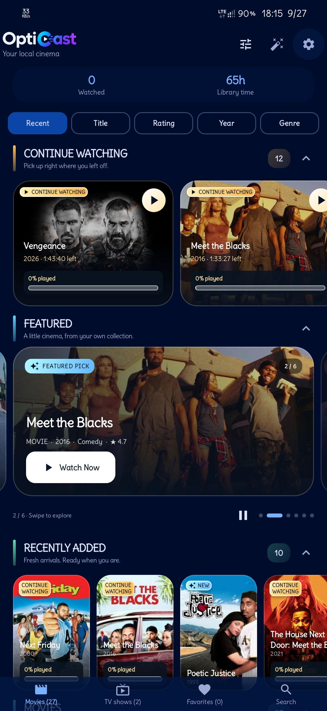
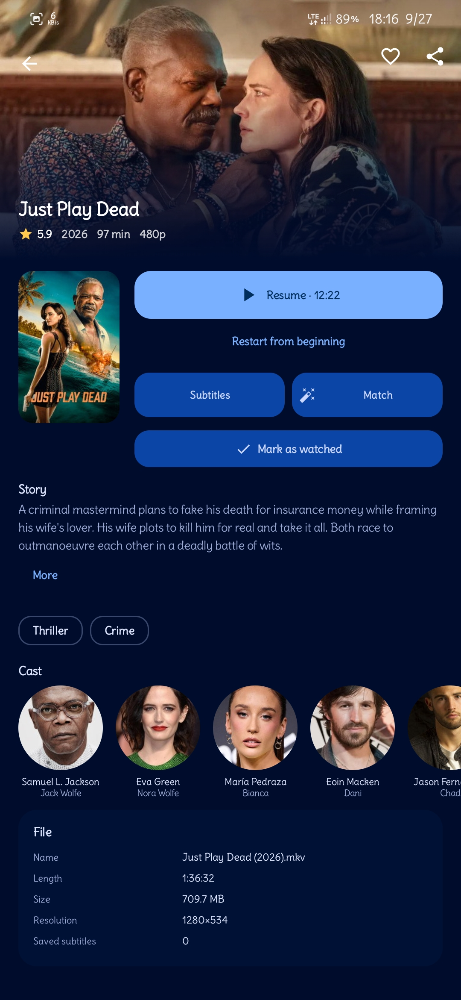
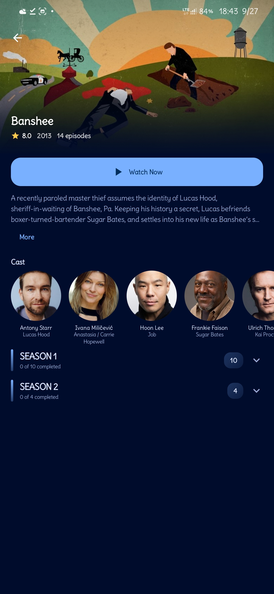
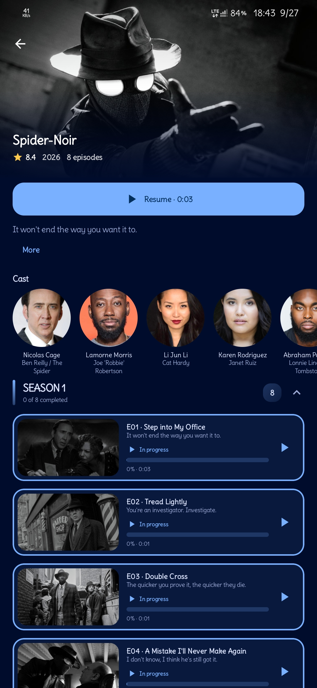
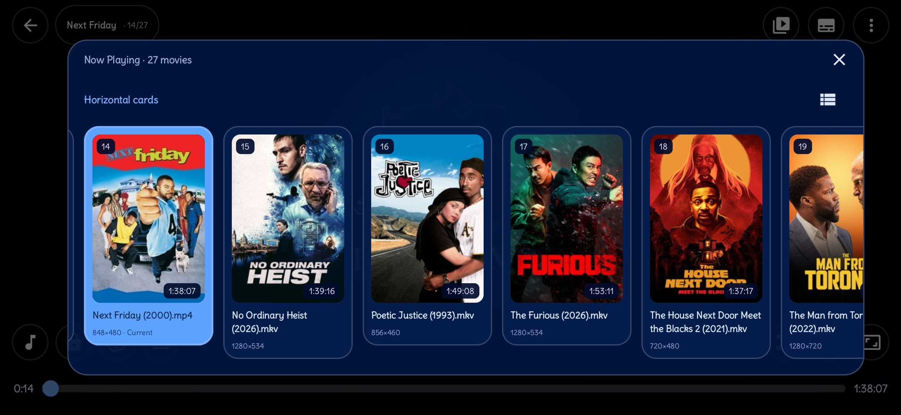
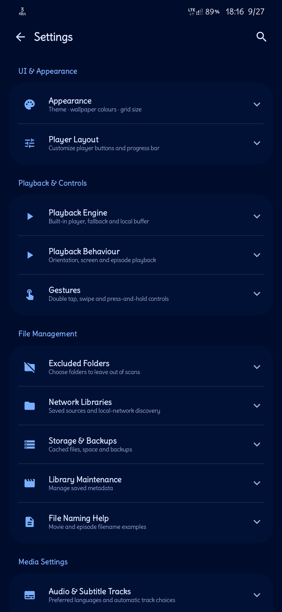

# OptiCast — Infuse-style Local Video Player

[](https://github.com/opticastplayer-dev/opticast/releases)
[](LICENSE)
[](https://f-droid.org/packages/com.opticast.player)
[](https://github.com/opticastplayer-dev/opticast/actions)

**OptiCast** is a beautiful, performance-focused local video player for Android — inspired by Infuse. Scans device, auto-identifies movies & TV shows, fetches posters from TMDB, subtitles from OpenSubtitles/SubDL, plays with **mpv** + Media3 fallback.

- **No ads, no tracking, GPL-3.0**
- **ARM32 + ARM64, Android 8+**
- **signed release — 56M with libmpv.so 6.1M + libavcodec 12M — plays all videos (Media3-only doesn't)**
- **PiP auto-resume fixed for 32-bit, in-app updates, What's New**
- **100% REAL device screenshots**

## ✨ Showcase — 100% REAL Device Captures

| Library Grid (27 movies) | Movie Detail - Just Play Dead | TV Show - Banshee |
|--------------------------|-------------------------------|-------------------|
|  |  |  |

| TV Show - Spider-Noir (8 eps) | Player - Now Playing 27 movies | Settings - 2.6.60 |
|-------------------------------|--------------------------------|-------------------|
|  |  |  |

**All screenshots are REAL captures from actual OptiCast app running on device — 6 REAL, no mockups, 17.64 MiB workspace clean.**

## Features

**Library:** MediaStore auto-scan, adaptive poster grid, Continue Watching, Movies/TV grouping, Favorites, Recently Added, sort Recent/Title/Rating/Year + genre filter, search, multi-select share/delete, excluded folders.

**Auto-matching:** `The.Bear.S02E05.1080p.WEB.h264.mkv` → TMDB, `Dune.Part.Two.2024.mkv` → Movie, `[Group] Title - 01 [1080p].mkv` → AniList fallback.

**Detail/Show:** Backdrop hero, poster, rating, genres, runtime, synopsis, cast headshots, episode list with In progress 0% tracking, Resume/Mark Watched/Refresh artwork/Share.

**Player (mpv + Media3):** **signed release default local** — libmpv.so 6.1M + libavcodec 12M + FFmpeg + libplacebo, Media3 fallback, edge-to-edge Compose: thick progress, ±10s, speed 0.5-3x, aspect fit/zoom/stretch, subtitle/audio picker, sync ±250ms, audio boost, EQ, gestures double-tap seek swipe volume/brightness hold 2x-4x, sleep timer, auto-play next 5s, chapters, MediaSession, Now Playing horizontal cards 14/27. **signed release plays all videos — Media3-only doesn't.**

**PiP:** Manual entry via PictureInPictureAlt icon, auto-resume on expand fixed for 32-bit (wasPlayingBeforePip + onReturnFromPip + 1000ms delay + RESUMED check), X closes.

**Subtitles:** OpenSubtitles+SubDL together, multi-lang, zip/gzip, auto-download best, in-player search & hot-swap.

**Extras:** OMDb IMDb/RT/Metacritic, Fanart.tv clearlogos, frame artwork, thumbnail cache scrub previews, offline poster cache w185/w342.

**Performance 2.6.60:** No runBlocking main, async settings, 6/16 MiB image cache, 64/192 MiB disk, no HW bitmaps lowRam RGB_565, ConcurrentHashMap, baseline profiles + R8 fullMode + dex-startup-opt, PlaybackWorkBudget gates downloads during playback.

**Updates:** GitHub API dual-repo fallback **LIVE repo first** opticastplayer-dev + opticast-project (fixed "Could not resolve opticast-project/opticast" error), 24h interval, manual check, Download & Install in-app via FileProvider, startup check, What's New dialog.

## Installation — Available For Everyone Now!

### GitHub Releases (Recommended) — signed release
1. Go to **https://github.com/opticastplayer-dev/opticast/releases**
2. **Latest: v2.6.60 signed release** — Download `OptiCast-v2.6.60.apk` **56M signed release with mpv** (libmpv.so 6.1M + libavcodec 12M + libavformat + libavfilter + libswscale + libopticast_mpv.so) — https://github.com/opticastplayer-dev/opticast/releases/download/v2.6.60/OptiCast-v2.6.60.apk
3. SHA256 `b5a2f0f8a7d84a03187c183905c03c8569d699685774612848957266b5a2d3d9` — verify in `SHA256SUMS-v2.6.60.txt`
4. Install APK (allow unknown sources)
5. Open → Grant video permission → Auto-scan → Enjoy!
6. Settings → Check for updates → Download & Install in-app for future versions — now checks **opticastplayer-dev/opticast** first (live), no more "Could not resolve opticast-project/opticast" error

**What's included in Release v2.6.60 signed release:**
- **APK 56M signed release** — ARM64 + ARM32 Android 8+, libmpv.so 6.1M + libavcodec 12M + FFmpeg + libplacebo, plays all videos (Media3-only 28M doesn't)
- Complete source 8.5M
- SHA256SUMS verification
- What's New dialog after update
- 6 REAL screenshots (100% real, no mockups)
- **Build #14 Success** 7m 42s — signed release restored from 2.6.59 APK via `project/native/restore-from-apk.py` (downloads 2.6.59 APK 32.9M, extracts 24 .so files, repacks AAR 26M, builds signed release APK 56M)

**Previous: v2.6.59** — 31.4M APK + 65.7M complete source — PiP fix + in-app updates + showcase

### F-Droid
- Metadata ready in `fastlane/` + 6 REAL screenshots (100% real)
- Pending inclusion — will be at https://f-droid.org/packages/com.opticast.player
- Badge in README

### Direct APK Build
```bash
# Full release with mpv (fast path — restore from existing APK):
python3 project/native/restore-from-apk.py  # downloads 2.6.59 APK, extracts .so, creates AAR 26M
cd project && ./gradlew assembleOfficialRelease  # builds signed release APK 56M

# Full source build from scratch (heavy, 1-2 hours):
bash project/native/build-native.sh arm64  # needs NDK r28c, meson, ninja, cmake, etc.
bash project/native/package-runtime.sh arm64
bash project/native/build-native.sh armv7l
bash project/native/package-runtime.sh armv7l
./gradlew assembleOfficialRelease

# Media3-only (quick, for testing, no mpv — doesn't play some videos):
./gradlew assembleDebug
```
Requires Android Studio Ladybug+ (AGP 8.7, Kotlin 2.0, compileSdk 36, minSdk 26, JDK 17)

## PiP Fix + Update Checker Fallback

**PiP 2.6.59:** 32-bit expanding PiP paused video. Fix: track wasPlayingBeforePip, onReturnFromPip → play(), 1000ms delay + onResume 150ms, RESUMED check. Files: PiPController.kt, PlayerActivity.kt, PlayerScreen.kt

**Update Checker 2.6.60:** **LIVE repo first** — now tries `opticastplayer-dev/opticast` (live) first, then `opticast-project/opticast` (desired org, doesn't exist yet) — fixes error screenshot "Could not resolve to a Repository with the name 'opticast-project/opticast'". Loop GITHUB_API_URLS with try/catch. Files: UpdateChecker.kt (order swapped live first), AboutExtras.kt (uses openReleasesPage() not hardcoded dead link)

**Signed Release Build 2.6.60:** `project/native/restore-from-apk.py` downloads 2.6.59 APK 32.9M, extracts 24 .so files (libavcodec 12M, libmpv 6.1M, etc.), repacks as `.cache/native-runtime/opticast-mpv-runtime.aar` 26M, then builds signed release APK 56M with mpv. Build #14 Success 7m 42s signed release. Files: restore-from-apk.py, build.gradle.kts (mpv optional for CI), release.yml (full_mpv input, restore step)

## Privacy & Permissions

INTERNET, ACCESS_NETWORK_STATE, READ_MEDIA_VIDEO, READ_EXTERNAL_STORAGE, POST_NOTIFICATIONS, FOREGROUND_SERVICE, FOREGROUND_SERVICE_MEDIA_PLAYBACK, REQUEST_INSTALL_PACKAGES, WAKE_LOCK. No analytics/ads/tracking.

## License & Credits

GPL-3.0-or-later — see LICENSE + app/src/main/assets/legal/. TMDB uses but not endorsed. Providers: TMDB, OpenSubtitles, SubDL, OMDb, Fanart.tv, AniList. mpv GPL-compatible controlled build pinned source.

Contact: opticastproject@gmail.com (WhatsApp removed 2.6.59)

## Roadmap

- [x] PiP auto-resume fix 32-bit
- [x] Remove WhatsApp Email only
- [x] In-app updates + startup check + dual-repo fallback LIVE first (fix "Could not resolve opticast-project" error)
- [x] What's New dialog
- [x] GitHub Actions release workflow — fixed block style YAML, duplicate deletion, gradlew generation, signing.properties always created, mpv optional + restore from APK
- [x] F-Droid metadata + fastlane — 6 REAL screenshots
- [x] 100% REAL device screenshots — 6 real captures (Library 997K, Just Play Dead 762K, Banshee 609K, Spider-Noir 778K, Player Now Playing 761K, Settings 317K) — NO mockups — 17.64 MiB clean
- [x] Build 2.6.60 APK signed release — 56M with libmpv.so 6.1M + libavcodec 12M — Build #14 Success 7m 42s signed release — restore-from-apk.py + optional native build
- [x] GitHub Release v2.6.60 signed release — 56M APK + 8.5M source + SHA256 — Media3-only doesn't play some videos, so only signed release available
- [ ] F-Droid inclusion MR
- [ ] Create org opticast-project and transfer (optional — fallback ensures no breakage)
- [ ] Optional: Add real PiP floating window screenshot if available (currently 6 real cover all features)

**Locked Baseline:** 2.6.60 / 110 — 746 tests, budget 17.64 MiB / 128 MiB cleaned (100% real), signed release 56M
**Live:** https://github.com/opticastplayer-dev/opticast — Releases v2.6.59 (31.4M) + **v2.6.60 signed release 56M** — 6 REAL screenshots — Build #14 Success signed release — Available for everyone now!
