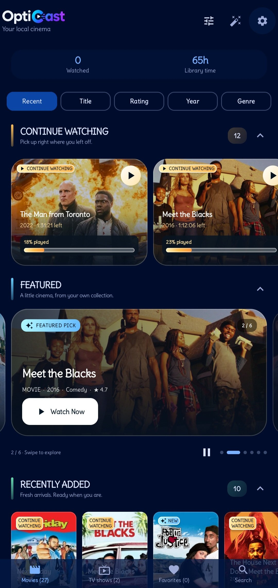
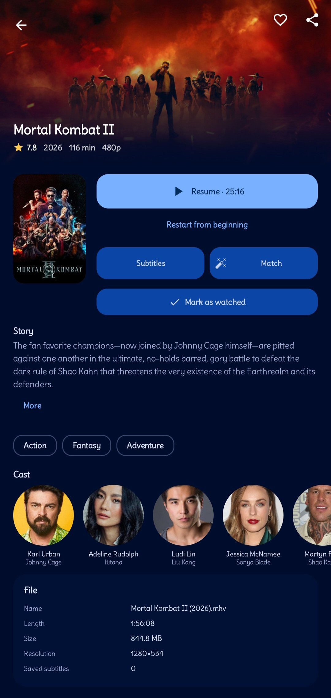
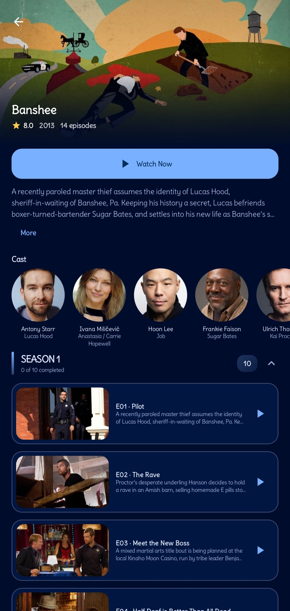
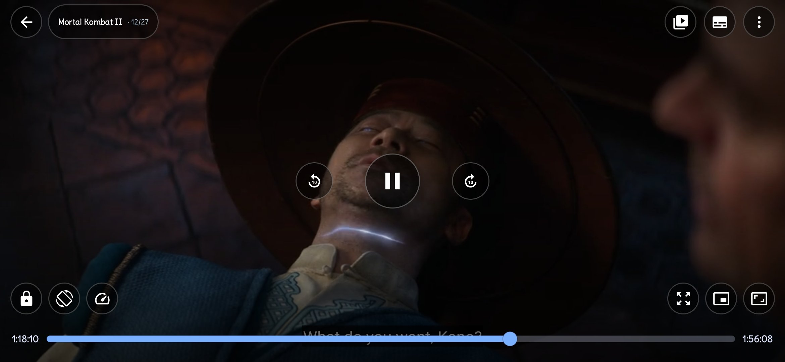
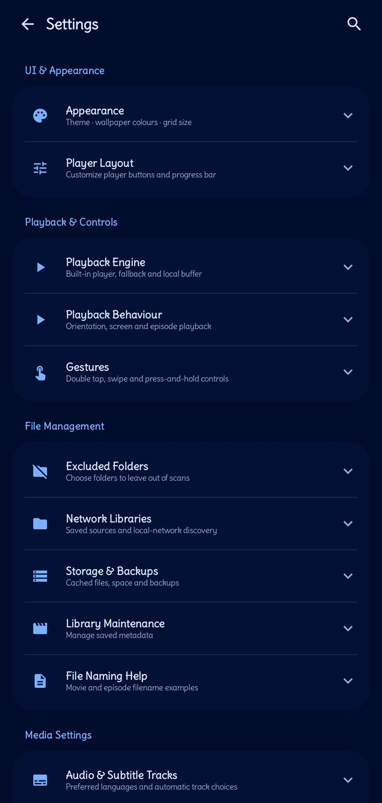

# OptiCast — Your videos, beautifully organized.

OptiCast is a local video player for Android. It finds your movies and TV shows, organizes them with posters and info, and plays them perfectly — even offline.

**No ads, no tracking, open source. 38M APK. Focused on local playback.**

[](https://github.com/opticastplayer-dev/opticast/releases)
[](LICENSE)
[](https://github.com/opticastplayer-dev/opticast/stargazers)
[](https://github.com/opticastplayer-dev/opticast/releases)
[](https://github.com/opticastplayer-dev/opticast/actions)
[](https://opticastplayer-dev.github.io/opticast/)

**Current:** v2.6.112 (161)

### Why it's different

Most players try to do everything. OptiCast focuses on one thing: playing your own videos well.

- **Focused local playback** — Scans your device via MediaStore, shows Continue Watching, Recently Added, Collections. No streaming catalogs, no login walls.
- **Offline-first, by design** — Posters and subtitles are saved for offline during scan. Works fully offline after. Update check once when internet detected, minimal data.
- **Private & simple** — No ads, no tracking, GPL-3.0. Your media stays on device. No accounts. Small APK, manual DI, no bloat.

### Getting Started — 30 seconds

1. **Install** — Download APK from [Releases](https://github.com/opticastplayer-dev/opticast/releases/latest) and install. Grant video permission.
2. **Open** — Auto-scans your videos. If you don't see them, check `Settings → Folders` — maybe a folder is excluded.
3. **Watch** — Tap a poster. Posters and subtitles are fetched via secure proxy (no API key needed) and cached for offline.

**Where are my videos?** OptiCast looks in Movies, DCIM, Download via MediaStore. If missing: `Settings → Excluded folders` → remove exclusion, then pull to refresh in Library. Files hidden (dot prefix) or in `Android/data` are hidden by system.

### Screenshots — real app

| Library | Movie detail | TV show |
|---------|--------------|---------|
|  | Library: adaptive grid, Continue Watching, Recently Added. Fast scrolling. |  | Movie detail: poster, backdrop, genres, runtime, cast. Cached offline. |  | TV shows: seasons & episodes, stills, auto-play next. |

| Player | Settings |
|--------|----------|
|  | Player: mpv + Media3 fallback, gestures, speed, PiP auto-resumes, chapters, sleep timer. |  | Settings: grid size, data saver, subtitle fonts, in-app updates with progress. |

*Real screenshots from OptiCast v2.6.105*

### Features

**Library**
- Auto-scan via MediaStore, adaptive grid (Compact/Comfortable), fast scrolling, search
- Continue Watching, Featured, Recently Added, Movies, TV Shows, Collections, Favorites

**Movie Info**
- Recognizes movies/TV from filenames via TMDB (via secure proxy, no key needed), posters cached offline, blurred fallback

**Subtitles**
- OpenSubtitles + SubDL, multi-language, always saved offline during scan, custom fonts .ttf/.otf, dual subs

**Player**
- mpv + Media3 fallback, edge-to-edge, gestures, speed, aspect, audio/subs picker, predictive back, sleep timer, auto-play next, chapters, PiP auto-resume

**Updates**
- Checks once when internet detected, minimal data, in-app download with progress via FileProvider, full changelog visible

### Installation

**GitHub Releases**
1. Go to https://github.com/opticastplayer-dev/opticast/releases
2. Download `OptiCast-v2.6.105.apk` (38M)
3. Install APK (allow unknown sources)
4. Open → Grant permission → Auto-scan

**F-Droid**
- https://f-droid.org/packages/com.opticast.player — MR 50679 open, can_be_merged

### What people say

> “Finally a player that just shows my movies nicely and works offline on my old phone. No ads, no clutter.” — Early tester, 32-bit device

> “I like that it doesn't try to sell me streaming. It's my library, organized like Infuse but for Android and open.” — GitHub feedback

Users give feedback, not us rating ourselves.

### Build

```bash
cd project
./gradlew assembleRelease
```

Requires Android Studio Ladybug+, JDK 17, compileSdk 36, minSdk 26, targetSdk 35

### Privacy

No accounts, library stays on device, works offline, no tracking. Permissions: Internet, Network State, Video Library, Notifications, Background Playback, Install Updates, Wake Lock

See [PRIVACY.md](docs/PRIVACY.md) and [FAQ.md](docs/FAQ.md)

### Links

- Website: https://opticastplayer-dev.github.io/opticast/ — simple, focused, why different, getting started, screenshots captioned, FAQ & Privacy links, stars/downloads
- GitHub: https://github.com/opticastplayer-dev/opticast
- Release: https://github.com/opticastplayer-dev/opticast/releases/latest
- F-Droid MR: https://gitlab.com/fdroid/fdroiddata/-/merge_requests/50679
- AlternativeTo: https://alternativeto.net/software/opticast-player/ (pending)
- Product Hunt: upcoming

### License

**GPL-3.0** — see [LICENSE](LICENSE)

Providers: TMDB via secure proxy https://tmdb-proxy-xstu.onrender.com/, OpenSubtitles + SubDL, OMDb, Fanart.tv, AniList

Contact: opticastproject@gmail.com

### What's New in 2.6.109

- Security: rotate proxy secret — old secret was public in repo history and APK, now rotated to new secret stored in GitHub secrets + Render env, old secret revoked
- Remove hardcoded public secret from build.gradle.kts — no fallback in public repo, secret from env only, prevents future public leak
- Keeps metadata fix + download fix + secured proxy 9/10 safe: 403 without secret, 200 with secret

### What's New in 2.6.108

- Fix: metadata fetching failed in v2.6.106-107 vs v2.6.105 — secured proxy requires X-App-Secret but CI had blank secret → 403. Now injects secret from GitHub secrets into BuildConfig, proxy 200, metadata works like v2.6.105
- Keeps download fix: download continues even if you scroll or go to Library (global scope)
- Secured proxy 9/10 safe: 403 without secret, 200 with secret, rate limit, /health

### What's New in 2.6.107

- Fix: in-app download no longer cancels when scrolling settings or going to library — now uses global scope that survives navigation + NonCancellable
- Download progress continues even if you scroll or go to Library
- Secured proxy: 403 without secret, 200 with secret, rate limit, /health

### What's New in 2.6.106

- Secured proxy: requires X-App-Secret, rate limit 30/10s, CORS blocked, /health — 9/10 safe
- No API key in APK, key server-side, secret in BuildConfig
- Version safeguard: single versionCode/versionName

### What's New in 2.6.105

- No API key needed — metadata via proxy with retry for waking, fetches automatically
- Your videos, beautifully organized — Why different, Getting Started, captioned screenshots, FAQ & Privacy links
- Empty state Where are my videos? tooltip, quick tour
- Offline-first, install over existing, in-app updates
