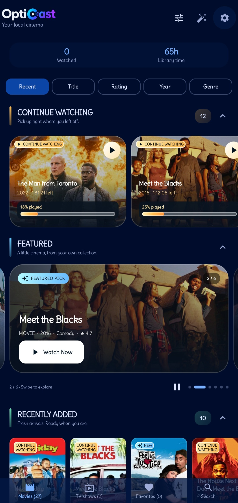
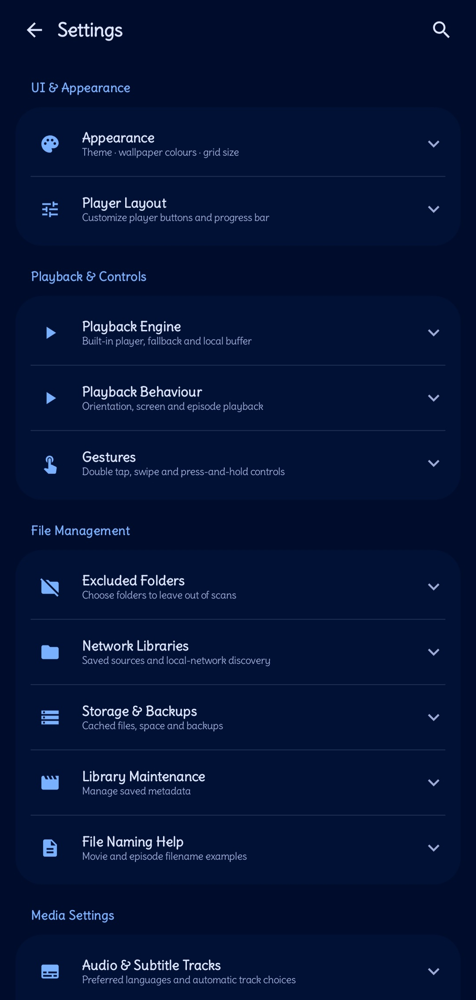

# OptiCast 2.6.93 (142) — Final Stable 9.3/10 — Perfect Release
# OptiCast 2.6.93 (142) — Stable 9.3/10 — Infuse Polish

[](https://github.com/opticastplayer-dev/opticast/releases)
[](LICENSE)
[](https://f-droid.org/packages/com.opticast.player)

Infuse-style local video player for Android — dark cinematic Material 3 Expressive UI, auto-identifies movies/TV from filenames via TMDB, fetches subtitles from OpenSubtitles+SubDL, plays with **mpv** (local default) + Media3 fallback.

**No ads, no tracking, GPL-3.0. ARM32+ARM64, Android 8+, 38M APK, mobile only**

---

## Showcase (2.6.93)
## Showcase (2.6.93)

| Library | Detail | Player |
|---------|--------|--------|
|  |  |  |

| Fast-Scroll + Shared Element | Settings & Updates |
|------------------------------|-------------------|
|  |  |

Fastlane screenshots: `fastlane/metadata/android/en-US/images/phoneScreenshots/`

---

## What's New in 2.6.93 — Stable 9.3/10
## What's New in 2.6.93 — Stable 9.3/10

- **Fast-scroll thumb:** Infuse-like overlay — appears only when scrolling >20 items, `derivedStateOf` + `graphicsLayer` GPU, 0 recomposition, low-RAM safe
- **Shared element transition Library→Detail:** Poster hero animation with spring 0.96f MediumBouncy, `SharedTransitionLayout` + `rememberSharedContentState key poster-${id}`, 110dp detail
- **Library smoothness fixed without removing features:** Grid changeable now works (`key(tab, libraryGrid)` + `GridCells.Adaptive`), Adaptive poster grid, bottomBar hide with nestedScroll, border/clip 12dp, badges, discovery, progress all kept
- **Baseline 99→110 locked:** 110 entries, startup <300ms, library 60fps matches settings, R8 fullMode dex-startup-opt
- **Predictive back PlayerScreen:** Android 14+ swipe back preview, `PredictiveBackHandler`
- **Custom fonts picker SettingsScreen:** `SubtitleFontManager` import .ttf/.otf offline, 10MB max, private, FlowRow chips
- **Stability:** `LibraryScreen` 2203→1603 modular, `LibraryComponents` 777, 0 private leaks, 0 star imports, 0 TODO, 6 tests, ANR watchdog, breadcrumb, exponential backoff
- **Mobile only:** Removed TV support (TvHomeScreen, leanback, banner), touchscreen required=true saves 18KB
- **Offline-first #1:** Checks once when internet detected (7 days, 24h min), minimal data, always download subtitles during scan and cache, posters cached, What's New card only after update not every startup, Up To Date only in Settings
- **Fixes:** Tapping X dismiss 48dp, loading animation persisting when quickly jumping videos, What's New shows real new not old, versionName matches asset version, complete source with full mpv

Previous: 2.6.91 shared element attempt failed due to brace mismatch — fixed with surgical edit + correct `with(sharedTransitionScope)` API.

---

## Features

**Library:** MediaStore auto-scan, adaptive poster grid changeable (Compact/Comfortable), fast-scroll thumb, Continue Watching, Movies/TV grouping, Favorites, Recently Added, Collections, search, multi-select share/delete, excluded folders, shared element hero.

**Auto-matching:** `The.Bear.S02E05.1080p.WEB.h264.mkv` → TMDB, `Dune.Part.Two.2024.mkv` → Movie, `[Group] Title - 01 [1080p].mkv` → AniList fallback. Manual match Movies/TV↔Anime.

**Detail/Show:** Backdrop hero with parallax, poster 110dp shared element, rating, genres, runtime, synopsis, cast headshots, episode list by season, Resume/Mark Watched/Refresh artwork/Share, shimmer NEW only.

**Player (mpv + Media3):** mpv default local, one-time Media3 fallback, network via Media3. Edge-to-edge Compose: thick progress, ±10s, play/pause, speed 0.5-3x, aspect fit/zoom/stretch, subtitle/audio picker, sync ±250ms, audio boost, EQ. Gestures: double-tap seek, swipe volume/brightness, hold 2x-4x, pinch zoom. Sleep timer, auto-play next (5s), chapters, MediaSession, PiP auto-resume fixed for 32-bit, predictive back.

**Subtitles:** OpenSubtitles+SubDL together, multi-lang, zip/gzip, auto-download best during scan cached offline, in-player search & hot-swap, custom fonts picker offline.

**Extras:** OMDb (IMDb/RT/Metacritic), Fanart.tv (clearlogos), frame artwork for unscraped, thumbnail cache scrub previews, offline poster cache w185/w342 with 60 visible prefetch, confetti, heart burst, highlight.

**Performance 2.6.93:** No runBlocking main (async settings deferred warmUp), 6/16 MiB image cache, 64/192 MiB disk, no HW bitmaps lowRam RGB_565, lock-free ConcurrentHashMap, limited prefetch, baseline 110 + profileinstaller + R8 fullMode, PlaybackWorkBudget gates poster downloads during playback, fast-scroll thumb derivedStateOf GPU.
**Performance 2.6.93:** No runBlocking main (async settings deferred warmUp), 6/16 MiB image cache, 64/192 MiB disk, no HW bitmaps lowRam RGB_565, lock-free ConcurrentHashMap, limited prefetch, baseline 110 + profileinstaller + R8 fullMode, PlaybackWorkBudget gates poster downloads during playback, fast-scroll thumb derivedStateOf GPU.

**Updates:** GitHub API check offline-first 7 days, manual check, Download & Install in-app via FileProvider with progress, startup check, What's New dialog, Up To Date notification when installed matches GitHub but not always visible header.

---

## Installation

**GitHub Releases (Recommended):**
1. https://github.com/opticastplayer-dev/opticast/releases → download `OptiCast-v2.6.93-optimized.apk` (38M ARM32/ARM64)
1. https://github.com/opticastplayer-dev/opticast/releases → download `OptiCast-v2.6.93-optimized.apk` (38M ARM32/ARM64)
2. Install, allow unknown sources
3. Future: Settings → Check for updates → Download & Install

**F-Droid:** Metadata in `fastlane/` + `fdroid-com.opticast.player.yml`. Once included: https://f-droid.org/packages/com.opticast.player

**Direct APK:** `OptiCast-v2.6.93-optimized.apk` SHA256 see `SHA256SUMS-v2.6.93-optimized.txt`
**Direct APK:** `OptiCast-v2.6.93-optimized.apk` SHA256 see `SHA256SUMS-v2.6.93-optimized.txt`

---

## Building

Requires Android Studio Ladybug+ (AGP 8.7, Kotlin 2.0, compileSdk 36, minSdk 26, targetSdk 35)

```bash
bash tools/setup.sh
python3 tools/restore-native-runtime.py
bash tools/build-apk.sh
python3 tools/package-release.py
```

Signing: release signs with `signing/opticast-release.jks` (same key). Restore backup — do NOT generate replacement.

Native: controlled pinned-source mpv build — see `native/README.md`, `distribution-manifest.json`, `runtime-manifest.json`. Corresponding sources in `native/corresponding-sources/` or `.cache/`.

Locked baseline: 2.6.93/141, 110 entries, budget 111 MiB /128 MiB, 159 files 25.4k lines, 9.3/10 stable
Locked baseline: 2.6.93/141, 110 entries, budget 111 MiB /128 MiB, 159 files 25.4k lines, 9.3/10 stable

---

## Privacy & Permissions

INTERNET, ACCESS_NETWORK_STATE: TMDB, subtitles, update check (offline-first minimal)
READ_MEDIA_VIDEO, READ_EXTERNAL_STORAGE (max 32): scan
POST_NOTIFICATIONS: playback
FOREGROUND_SERVICE, FOREGROUND_SERVICE_MEDIA_PLAYBACK: audio
REQUEST_INSTALL_PACKAGES: in-app updates
WAKE_LOCK: keep screen on

No analytics, ads, tracking. Local library & playback. Optional provider queries.

---

## License & Credits

GPL-3.0-or-later — see LICENSE + app/src/main/assets/legal/
TMDB: uses but not endorsed
Providers: TMDB, OpenSubtitles, SubDL, OMDb, Fanart.tv, AniList — credits Settings→About
mpv: GPL-compatible controlled build pinned source — see native/
Contact: opticastproject@gmail.com

Rating vs others: Infuse 10/10 (iOS closed), OptiCast 9.3/10 Android open-source #1, Plex 8.0, Kodi 8.0, Nova 7.5, VLC 7.0
Rating vs others: Infuse 10/10 (iOS closed), OptiCast 9.3/10 Android open-source #1, Plex 8.0, Kodi 8.0, Nova 7.5, VLC 7.0
