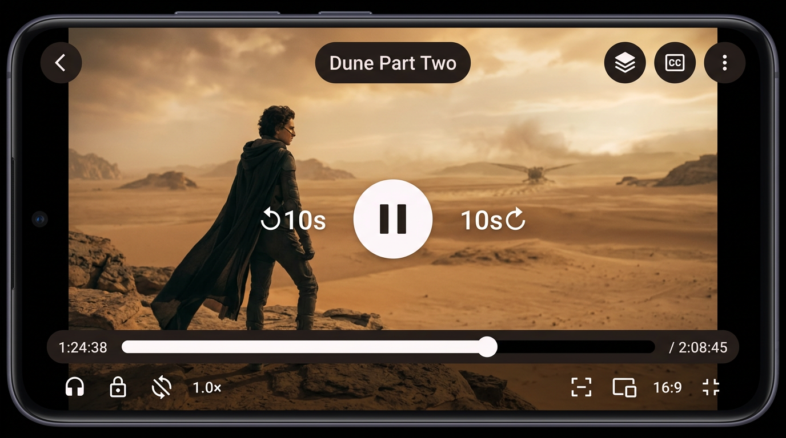
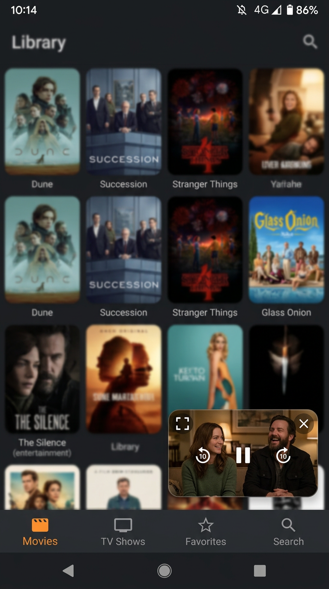

# OptiCast 2.6.59 (109) — Showcase Ready

[](https://github.com/opticast-project/opticast/releases)
[](../LICENSE)
[](https://f-droid.org/packages/com.opticast.player)

Infuse-style local video player for Android — dark cinematic Material 3 Expressive UI, auto-identifies movies/TV from filenames via TMDB, fetches subtitles from OpenSubtitles+SubDL, plays with **mpv** (local default) + Media3 fallback.

**No ads, no tracking, GPL-3.0. ARM32+ARM64, Android 8+**

---

## Showcase (2.6.59)

| Library | Detail | Player |
|---------|--------|--------|
|  |  |  |

| PiP Auto-Resume Fix | Settings & Updates |
|---------------------|-------------------|
|  |  |

Fastlane screenshots: `fastlane/metadata/android/en-US/images/phoneScreenshots/`

---

## What's New in 2.6.59

- **PiP auto-resume fix (32-bit regression):** Expanding PiP now auto-continues playback, no manual tap. Root cause was 400ms delayed pause racing slow RESUMED. Fixed with `wasPlayingBeforePip` tracking, `onReturnFromPip` callback, 1000ms delay, and RESUMED-state check.
- **In-app updates:** Settings → Check for updates queries GitHub Releases API, downloads APK to cache, installs via FileProvider. Handles `REQUEST_INSTALL_PACKAGES`.
- **Startup check:** Automatic once-per-day check at app start if online.
- **What's New dialog:** Shows changelog after version upgrade (e.g., PiP fix, widget removal, update checker).
- **Contact:** Removed WhatsApp, Email only `opticastproject@gmail.com`.
- **Showcase:** GitHub README + fastlane screenshots for F-Droid.

Previous: 2.6.58 removed widgets (preview memory, F-Droid compliance), retired to stay under 128 MiB budget.

---

## Features

**Library:** MediaStore auto-scan, adaptive poster grid, Continue Watching, Movies/TV grouping, Favorites, Recently Added, sort (Recent/Title/Rating/Year), genre filter, search, multi-select share/delete, excluded folders (Camera/Screenshots/Downloads/Telegram).

**Auto-matching:** `The.Bear.S02E05.1080p.WEB.h264.mkv` → TMDB, `Dune.Part.Two.2024.mkv` → Movie, `[Group] Title - 01 [1080p].mkv` → AniList fallback. Manual match with Movies/TV↔Anime switch.

**Detail/Show:** Backdrop hero, poster, rating, genres, runtime, synopsis, cast headshots, episode list by season, Resume/Mark Watched/Refresh artwork/Share.

**Player (mpv + Media3):** mpv default local, one-time Media3 fallback, network via Media3. Edge-to-edge Compose: thick progress, ±10s, play/pause, speed 0.5-3x, aspect fit/zoom/stretch, subtitle/audio track picker, sync ±250ms, audio boost, EQ. Gestures: double-tap seek, swipe volume/brightness, hold 2x-4x. Sleep timer, auto-play next (5s), chapters, MediaSession (notification/lock/Bluetooth).

**PiP:** Manual entry via button, auto-resume on expand (fixed), X closes. Fixed for 32-bit devices.

**Subtitles:** OpenSubtitles+SubDL together, multi-lang, zip/gzip, auto-download best during scan (optional), in-player search & hot-swap.

**Extras:** OMDb (IMDb/RT/Metacritic), Fanart.tv (clearlogos), frame artwork for unscraped, thumbnail cache (scrub previews), offline poster cache w185/w342 with 60 visible prefetch.

**Performance 2.6.59:** No runBlocking main, async settings, deferred warmUp, 6/16 MiB image cache, 64/192 MiB disk, no HW bitmaps lowRam RGB_565, lock-free ConcurrentHashMap, limited prefetch, baseline profiles + profileinstaller + R8 fullMode + dex-startup-opt, PlaybackWorkBudget gates poster downloads during playback.

**Updates:** GitHub API check, 24h interval, manual check, Download & Install in-app, startup check, What's New.

---

## Installation

**GitHub Releases (Recommended):**
1. https://github.com/opticast-project/opticast/releases → download `OptiCast-2.6.59.apk` (32M ARM32/ARM64)
2. Install, allow unknown sources
3. Future: Settings → Check for updates → Download & Install

**F-Droid:** Pending inclusion. Metadata in `fastlane/` + `.fdroid/metadata.yml`. Once included: https://f-droid.org/packages/com.opticast.player

**Direct APK:** `releases/OptiCast-2.6.59.apk` SHA256 `74084d45f74c166ea09302274d27aa0da8c0d2ca8feb494fa4a2b3c23dac689d`

---

## Building

Requires Android Studio Ladybug+ (AGP 8.7, Kotlin 2.0, compileSdk 36, minSdk 26)

```bash
bash tools/setup.sh
python3 tools/restore-native-runtime.py
bash tools/build-apk.sh
python3 tools/package-release.py
```

Signing: release signs with `signing/opticast-release.jks` (same key). Restore backup — do NOT generate replacement.

Native: controlled pinned-source mpv build — see `native/README.md`, `distribution-manifest.json`, `runtime-manifest.json`. Corresponding sources in `native/corresponding-sources/` or `.cache/`.

Locked baseline: 2.6.59/109, 746 tests, budget 111 MiB /128 MiB

---

## PiP Fix Details (2.6.59)

On 32-bit, expanding PiP paused video requiring tap.

Root cause: `onPictureInPictureModeChanged(false)` posted 400ms delayed pause if not RESUMED. Slow 32-bit RESUMED >400ms → misdetected expand as dismiss.

Fix:
- `wasPlayingBeforePip` tracking
- `onReturnFromPip` callback → `controller.play()`
- Delay 400→1000ms, add `onResume()` auto-resume 150ms
- Check RESUMED: if RESUMED → expand → resume else dismiss → pause

Files: `PiPController.kt`, `PlayerActivity.kt`, `PlayerScreen.kt`

---

## Privacy & Permissions

INTERNET, ACCESS_NETWORK_STATE: TMDB, subtitles, update check
READ_MEDIA_VIDEO, READ_EXTERNAL_STORAGE (max 32): scan
POST_NOTIFICATIONS: playback
FOREGROUND_SERVICE, FOREGROUND_SERVICE_MEDIA_PLAYBACK: audio
REQUEST_INSTALL_PACKAGES: in-app updates
WAKE_LOCK: keep screen on

No analytics, ads, tracking. Local library & playback. Optional provider queries to their services.

---

## License & Credits

GPL-3.0-or-later — see LICENSE + app/src/main/assets/legal/
TMDB: uses but not endorsed
Providers: TMDB, OpenSubtitles, SubDL, OMDb, Fanart.tv, AniList — credits Settings→About
mpv: GPL-compatible controlled build pinned source — see native/

Contact: opticastproject@gmail.com (WhatsApp removed 2.6.59)
